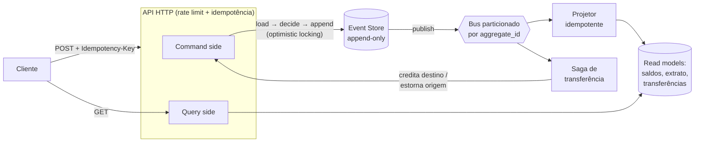

# eventledger

[](https://github.com/viitorveloso/eventledger/actions/workflows/ci.yml)
[](https://go.dev/)
[](LICENSE)

Event-sourced ledger in Go — transfers, sagas, Postgres & memory.

Ledger bancário com **Event Sourcing + CQRS** em Go. Contas, depósitos, saques e transferências entre contas com consistência garantida sob concorrência, trilha de auditoria imutável e recuperação automática de falhas.

Uma única dependência externa (`lib/pq`, o driver Postgres). Todo o resto  event store, bus particionado, saga, projeções, idempotência HTTP, rate limiting é implementado do zero na stdlib, porque o objetivo do projeto é demonstrar a **lógica**, não colar bibliotecas.

```bash
docker compose up --build -d   # sobe Postgres + API em :8080
./scripts/demo.sh              # roteiro completo de demonstração
go test -race ./...            # unidade + concorrência, sem infra
```
## Quick Start

Rápido para começar localmente:

```bash
# Docker (recomendado)
docker compose up --build -d
./scripts/demo.sh

# Local (Postgres em localhost:5432, user/pass/db: ledger)
go run ./cmd/api

# Testes rápidos
go test ./...
```
## Arquitetura



**Fluxo de escrita.** Todo comando carrega o agregado (replay do stream de eventos, acelerado por snapshot), valida a regra de negócio contra o estado atual e faz `append` exigindo a versão esperada. O estado nunca é atualizado apenas eventos são acrescentados. `GET /accounts/{id}/events` expõe a trilha completa.

**Fluxo de leitura.** Saldo, extrato e status de transferência saem exclusivamente dos read models materializados pelo projetor. O event store nunca é consultado para servir leitura.

**Transferência (saga).** O débito da origem é **síncrono**: saldo é validado na hora e transferência sem fundos recebe `422` imediatamente nada de aceitar com `202` para falhar depois. O crédito no destino é assíncrono; se for impossível (conta inexistente/fechada), a saga emite `transfer.reversed` na origem e o dinheiro volta. O cliente acompanha em `GET /transfers/{id}`: `pending → completed | reversed`.

## As cinco garantias que o código prova

**1. Saldo nunca fica negativo, sem lock pessimista.** O optimistic locking mora numa constraint: `UNIQUE (aggregate_id, version)`. Dois writers que leram o mesmo estado colidem no `INSERT`; o perdedor recarrega o agregado já atualizado, re-valida o saldo e tenta de novo (com backoff + jitter, até 5×). `TestConcurrentWithdrawalsNeverOverdraw` dispara 50 goroutines contra uma conta de R$ 100 sacando R$ 10 — no máximo 10 passam, a contabilidade fecha no centavo, e roda sob `-race`. `TestOptimisticLockingUnderRealConcurrency` repete a prova contra o Postgres de verdade com barreira de sincronização: 20 writers, exatamente 1 vence.

**2. Idempotência em três camadas.** (a) HTTP: `Idempotency-Key` obrigatória em todo comando, com reserva pessimista da chave — requests simultâneos com a mesma chave não executam duas vezes (o segundo recebe `409` enquanto o primeiro voa, e replay depois devolve a resposta original com header `Idempotency-Replay`). Mesma chave com payload diferente → `422`. (b) Saga: crédito e estorno checam por `transfer_id` no event store antes de agir — entrega duplicada vira no-op. (c) Projeção: cada evento é aplicado na mesma transação que o insere em `processed_events` (PK = event_id); duplicata não afeta linha e a transação vira no-op. Efeito e marca são atômicos: não existe "aplicou mas não marcou".

**3. Ordem por conta, paralelismo entre contas.** O bus in-process particiona por `hash(aggregate_id)` — eventos da mesma conta sempre caem na mesma partição e são processados em sequência; contas diferentes andam em paralelo. É exatamente a semântica de um tópico Kafka com key = aggregate_id, e `TestOrderPreservedPerAggregate` prova a ordem sob publicação concorrente.

**4. Crash em qualquer ponto não perde dinheiro.** Existe uma janela entre gravar o evento e publicá-lo no bus. Em vez de fingir que ela não existe, o boot resolve: o projetor reaplica todo evento fora de `processed_events` (a tabela `events` funciona como Transactional Outbox e o catch-up é o relay), e a saga retoma todo `transfer.debited` sem crédito nem estorno correspondente. `TestCatchUpResumesPendingTransfer` simula o crash e verifica a retomada. Só depois do catch-up a API abre.

**5. Auditoria de graça.** Nenhum `UPDATE`, nenhum `DELETE`. O estorno de uma transferência que falhou não apaga nada — acrescenta um evento com o motivo. O stream conta a história completa, que é requisito regulatório em sistema financeiro, não um extra.

## Decisões e trade-offs

**Por que o bus é in-process e não Kafka?** Porque o que o Kafka daria a este domínio — partição por chave, ordem por partição, fan-out, at-least-once — está implementado e testado na interface `bus.Bus`. Trocar a implementação por um producer Kafka não muda uma linha do domínio, da saga ou do projetor. Para um projeto de avaliação, infra pesada esconde a lógica e dificulta rodar; a seção de evolução abaixo descreve a troca.

**Por que o débito é síncrono se a proposta clássica é 202 full-async?** Aceitar uma transferência sem validar saldo significa aceitar transferências que vão falhar — pior experiência e mais compensações. Validar o débito na hora custa uma leitura do agregado (barata com snapshot) e elimina a classe inteira de "aceitei mas não devia". O que continua assíncrono (crédito) é o que de fato se beneficia: falha do destino não trava a origem.

**Por que dinheiro é `int64` em centavos?** Float em dinheiro é bug esperando data pra acontecer. `BIGINT` no banco, `int64` no Go, aritmética exata.

**Por que snapshots?** Reconstruir um agregado com 100 mil eventos a cada comando não escala. A cada 50 eventos o estado é fotografado; o load vira snapshot + delta. O snapshot é otimização best-effort fora da transação de escrita — se falhar, o replay completo continua correto.

**Read model no Postgres e não no Redis?** CQRS exige modelos separados, não bancos separados. As tabelas de leitura já são desnormalizadas e servidas por índice; o pacote `query` é o único que as toca, então apontá-lo para Redis é mudança local. Menos moving parts para o avaliador rodar.

## Rodando

```bash
# Docker (recomendado)
docker compose up --build -d
./scripts/demo.sh

# Local: Postgres em localhost:5432 (user/pass/db: ledger)
make run

# Testes
make test        # unidade + concorrência com -race (sem infra)
make test-all    # + integração e e2e contra Postgres real
```

A CI (GitHub Actions) roda `go vet` e a suíte completa com `-race` contra um Postgres real em todo push.

## API

| Método | Rota | Descrição |
|---|---|---|
| POST | `/accounts` | Abre conta (depósito inicial opcional) |
| POST | `/accounts/{id}/deposits` | Deposita |
| POST | `/accounts/{id}/withdrawals` | Saca (valida saldo) |
| POST | `/transfers` | Transfere: débito síncrono, crédito via saga → `202` |
| GET | `/accounts/{id}/balance` | Saldo (read model) |
| GET | `/accounts/{id}/statement?limit=&before=` | Extrato paginado por cursor |
| GET | `/transfers/{id}` | Status: `pending → completed \| reversed` |
| GET | `/accounts/{id}/events` | Trilha de auditoria (event stream) |
| GET | `/healthz` | Health check |

Todo POST exige `Idempotency-Key`. Erros de negócio mapeiam para HTTP: sem saldo `422`, conta inexistente `404`, valor inválido `400`, conflito persistente de concorrência `409` com `Retry-After`. Rate limit: Token Bucket por IP (50 req/s, burst 100) → `429`.

Valores em **centavos** (`amount_cents`).

## Estrutura

```
cmd/api/            wiring, boot com catch-up, graceful shutdown
internal/domain/    agregado, eventos, regras — Go puro, zero deps
internal/eventstore/ porta + Postgres (locking, snapshots) + memória (testes)
internal/bus/       bus particionado in-process (interface p/ Kafka)
internal/app/       command handlers: load → decide → append → publish
internal/saga/      orquestração da transferência + compensação + catch-up
internal/projection/ materialização idempotente dos read models
internal/query/     leituras (só read models)
internal/api/       HTTP, idempotência, rate limit, mapeamento de erros
migrations/         schema (write side + read side)
```

HEAD
=======
## Topics & Contributing

- Topics recomendados: `go`, `event-sourcing`, `postgres`, `ledger`, `saga`, `idempotency`

Contribuições são bem-vindas. Abra issues para bugs ou features e PRs na branch `main` com descrições claras das mudanças e comandos para reproduzir locais.

>>>>>>> chore/split-initial
## Evolução para produção

O desenho já separa as portas; a troca é de implementação:

1. **Kafka no lugar do bus in-process** — producer com key = `aggregate_id` implementando `bus.Bus`; projetor e saga viram consumer groups em deploys independentes, e o catch-up existente segue cobrindo a lacuna outbox→broker (ou entra Debezium/CDC sobre a tabela `events`).
2. **Redis para o saldo quente** — o projetor passa a escrever também no Redis; `query.Balance` lê de lá com fallback ao Postgres. Extrato permanece em réplica de leitura.
3. **Chaves de idempotência com TTL** — hoje crescem sem expurgo; em produção, TTL de 24h + job de limpeza.
4. **Autenticação/autorização, TLS, observabilidade** (métricas Prometheus + tracing) — fora do escopo desta avaliação por decisão consciente, não por desconhecimento.
5. **Múltiplas instâncias da API** — o optimistic locking já é seguro entre processos (a constraint é do banco); o que exige coordenação é a saga (consumer group resolve) e o rate limiting (mover para o gateway ou Redis).
